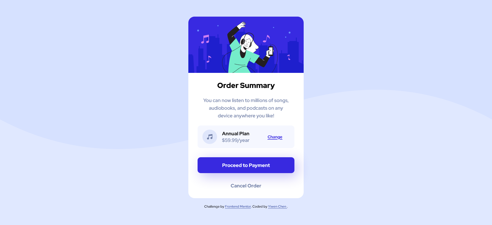

# Frontend Mentor - Order summary card solution

This is a solution to the [Order summary card challenge on Frontend Mentor](https://www.frontendmentor.io/challenges/order-summary-component-QlPmajDUj). Frontend Mentor challenges help you improve your coding skills by building realistic projects. 

## Table of contents

- [Overview](#overview)
  - [The challenge](#the-challenge)
  - [Screenshot](#screenshot)
  - [Links](#links)
- [My process](#my-process)
  - [Built with](#built-with)
  - [What I learned](#what-i-learned)
  - [Continued development](#continued-development)
  - [Useful resources](#useful-resources)
- [Author](#author)


## Overview

### The challenge

Users should be able to:

- See hover states for interactive elements

### Screenshot




### Links

- Solution URL: [GitHub](https://github.com/CHEN-YiWen/Order-summary-component)
- Live Site URL: [Add live site URL here](https://your-live-site-url.com)

## My process

### Built with

- Semantic HTML5 markup
- CSS custom properties
- Flexbox

### What I learned

- As I am trying to get familiar with   <code>display:flex</code>, I use it for   the layout. 
  I think it comes handy when I tried to align everything in the div of pricing and plan. 

- At first I tried to use <code>justify-content</code> to create spacing within the pricing div. However I did not get the result I wanted. I turned to <code>background-image</code>and added some padding to the right of the icon. I think it looks decent.

```css
.plan{
    background-image: url(images/icon-music.svg);
    background-repeat: no-repeat;
    background-size: 40px 40px;
    background-position: 20px;
}
.detail{
    padding-left: 40px;
}
```
- Thanks to @elaineleung 's comment on my solution to [QR-code-component](https://www.frontendmentor.io/solutions/qrcodecomponent--5wftdpyJm). I now know by using <code>max-width</code>, I can make the card responsive. I will keep practicing it. She also provide me some insights about how to make the html more structural.


### Continued development

- The position of the background image isn't exactly the same as the original design. I am still trying to figure out how to place it a bit higher.

- Still need to learn how to make the card more responsive. Once the width of the browser is super small, the card looks weird.

### Useful resources

- [5. min width and max width - Responsive CSS Tutorial](https://www.youtube.com/watch?v=9JIg7mti6Y4) - This video helped me to understand the difference between <code>min-width</code> and <code>max-width</code>.

## Author

- Frontend Mentor - [@Yiwen Chen](https://www.frontendmentor.io/profile/CHEN-YiWen)

